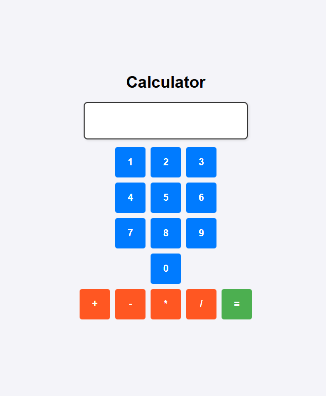

# React Calculator App

A simple calculator built with React that allows users to perform basic arithmetic operations like addition, subtraction, multiplication, and division.

## Features

- **Basic Arithmetic Operations**: Supports addition (+), subtraction (-), multiplication (\*), and division (/).
- **Responsive UI**: A clean, user-friendly interface with clickable buttons for digits and operators.
- **State Management**: Manages user input and performs calculations using React state and refs.

## Tech Stack

- **React**: For building the user interface and handling state.
- **CSS**: For styling the calculator UI.
- **ESLint**: For code quality and linting.
- **Vite**: For building and serving the project.

## How to Run the Project Locally (Installation and Usage):

    1. open the terminal and navigate to the project directory.
    2. npm install to install the dependencies.
    3. npm run dev to start the development server.
    4. Open the project in your browser and start using the calculator. (https://localhost:5173/)

## Screenshot

